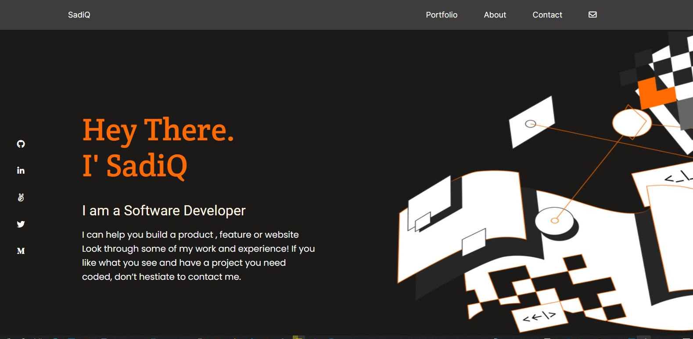

# Portfolio: setup and mobile version skeleton
> My Fifth Project Making Desktop Version.

## Built With

- HTML & CSS
- GitHub Workflows
- Figma
- Browser Developer Tools.

## Live Demo

## Getting Started

To get a local copy up and running follow these simple example steps.

Clone the project by:

git clone https://github.com/kingqabil/My-Portfolio

cd into the project folder by:

cd My-Portfolio

Open folder with code editor

### Prerequisites

- Web Browser.
- Code Editor.

## Authors

👤 **SadiQ HabiL**

- GitHub: [@kingqabil](https://github.com/kingqabil)
- Twitter: [@kingqabil](https://twitter.com/kingqabil)
- LinkedIn: [@kingqabil](https://linkedin.com/in/kingqabil)

## 🤝 Contributing

Contributions, issues, and feature requests are welcome!

Feel free to check the [issues page](../../issues/).

## Show your support

Give a ⭐️ if you like this project!

## Acknowledgments

- Hat tip to anyone whose code was used
- Inspiration
- etc

## 📝 License

This project is [MIT](./MIT.md) licensed.
